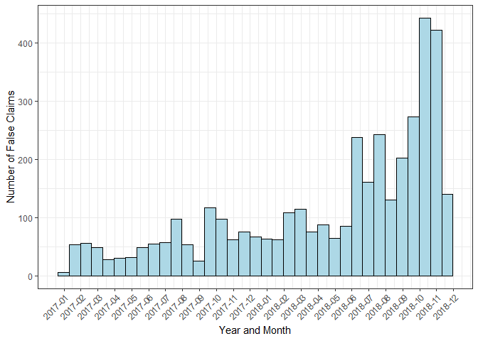

<!-- badges: start -->

[](https://www.tidyverse.org/lifecycle/#experimental)
[](https://github.com/friendly/TrumpLies)

<!-- badges: end -->

# TrumpLies 

The `TrumpLies` package makes available in R the database of false
claims by Donald Trump from 2017-2018 compiled by Daniel Dale at *The
Toronto Star*. While largely of historical interest, there may still be
some use for this in analysis and for data visualization.

## Installation

This package is presently maintained in on Github, pending public
release. You can install the package via:

``` r
# install.packages(c("devtools", "remotes"))
remotes::install_github("friendly/TrumpLies")
```

## License

This package is released under the [Creative Commons CC
BY-NC-SA](https://creativecommons.org/licenses/by-nc-sa/2.0/ca/)
license. This means that appropriate credit for use must be given and it
**cannot be used for commercial purposes**.

See `citation("TrumpLies")` for an appropriate citation for the package.
In addition, graphs or tables published from this should cite the source
of the data as *Data source: Daniel Dale, The Toronto Star*.

## Example

This is a basic example showing a simple histogram of frequencies of
Trump lies by month using `ggplot2`:

``` r
## basic example code
library(TrumpLies)
library(ggplot2)
#> Warning: package 'ggplot2' was built under R version 4.4.3
library(scales)
data(TrumpLies)

ggplot(TrumpLies, aes(x=date))  +
  geom_histogram(binwidth=20, colour="black", fill="lightblue") +
  scale_x_date(labels = scales::date_format("%Y-%m"),
               breaks = seq(min(TrumpLies$date)-5, max(TrumpLies$date)+5, 30)) +
  ylab("Number of False Claims") + 
  xlab("Year and Month") +
  theme_bw() + 
  theme(axis.text.x = element_text(angle=45, vjust = 1, hjust=1))
```


